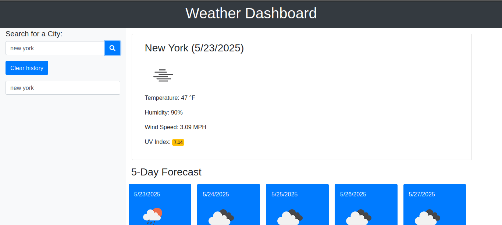
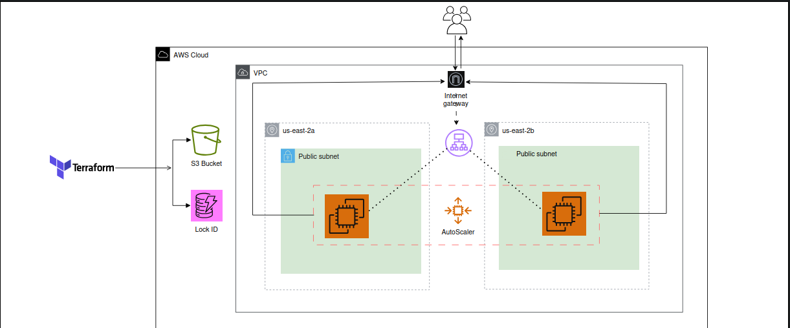

# WeatherApp Dashboard - Terraform AWS Deployment

Welcome to the WeatherApp Dashboard! This project automates the deployment of a weather dashboard web app on AWS using Terraform.



Whether you're experimenting with infrastructure as code or deploying production-ready services, this repo has your back.

---

## Table of Contents

- [What This Project Does](#what-this-project-does)
- [Requirements](#requirements)
- [How to Use](#how-to-use)
- [Auto Scaling & Load Balancer](#auto-scaling--load-balancer)
- [VPC Networking](#vpc-networking)
- [CI/CD Pipeline (GitLab)](#cicd-pipeline-gitlab)
- [Cleanup](#cleanup)
- [Credits](#credits)
- [Tips](#tips)

---

## What This Project Does

It provisions a highly available, scalable, and fault-tolerant AWS architecture for a weather dashboard. Here’s what’s under the hood:

- ✅ Custom VPC with public subnets  
- ✅ EC2 instances serving a weather app via Nginx  
- ✅ Auto Scaling Group behind a Load Balancer  
- ✅ Fully automated with user data scripts  
- ✅ S3 + DynamoDB backend for Terraform state management  
- ✅ CI/CD pipeline with GitLab CI  



---

## Requirements

- AWS CLI configured  
- Terraform v1.3+  
- A valid AWS Key Pair  
- GitLab account (if using CI/CD)  


---

## How to Use

### 1. Clone the Repo

```bash
git clone https://github.com/kelvin005/Aws-weather-dashboard.git
cd weatherapp-dashboard

2. Configure variables (edit variables.tf or use a terraform.tfvars file)

3. Initialize Terraform
   terraform init

4. Validate the configuration
   terraform validate

5. Plan the deployment
    terraform plan -out=tfplan

6.  Apply it
    terraform apply "tfplan"

7.  Done!  Open your AWS EC2 IP or Load Balancer DNS to see the weather app live.


Auto Scaling & Load Balancer

The loadbalancer/ module includes:

   1. Launch Template with bootstrapping

   2. Target Group for health checks

   3. auto scaling group (1-3 instances)

   4. Application Load Balancer routing to healthy instances


vpc networking

custom-built vpc with:

   1. 2 public subnets (in different azs)

   2. internet gateway

   3. public route tables

   4. security group (ports 22, 80, 443, open)


CI/CD Pipeline (GitLab)

Automated stages:

    Validate → Plan → Apply → Destroy (manual)

Built with the official Terraform Docker image, ready to integrate into your GitLab workflows.


Cleanup

To tear it all down:

terraform destroy

Or trigger the destroy stage from GitLab pipeline manually.


Credits
    Weather app js & html code  by @sylviaprabudy
    Terraform modules lovingly crafted by me ❤️

Tips

    Always commit your planfile before applying via CI

    Rotate your key pairs frequently

    Monitor costs—autoscaling = dynamic billing!

